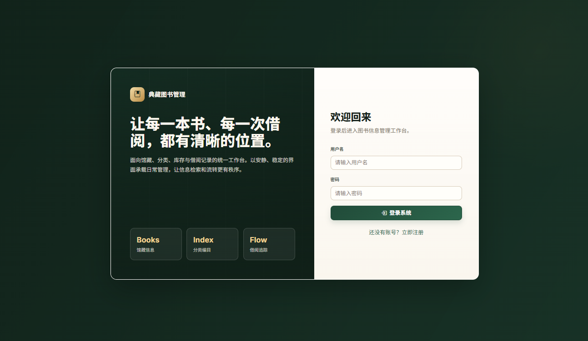
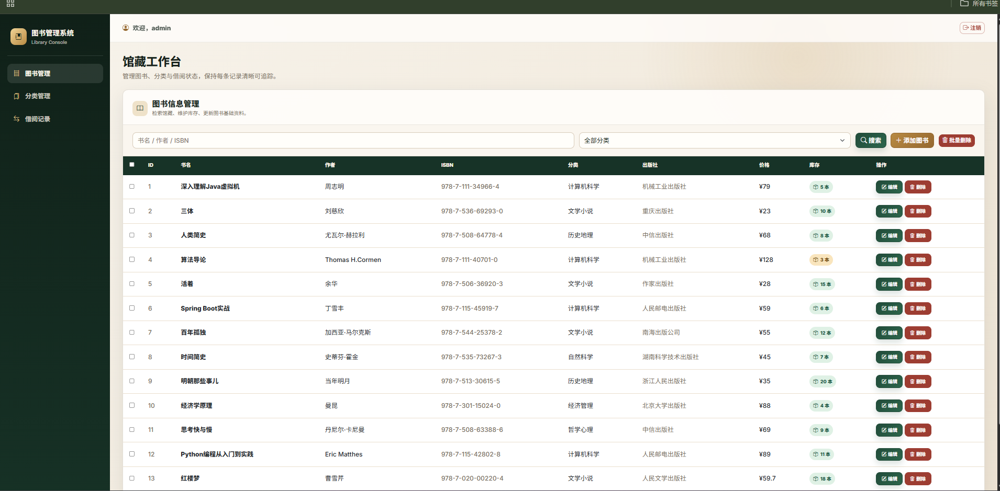

# 图书信息管理系统

基于 **Spring Boot 2.7 + MyBatis + MySQL** 的图书信息管理系统（系统设计大作业）。前端使用 Bootstrap 5 + jQuery，通过 AJAX + JSON 实现前后端数据交互。支持三种数据库部署模式：Docker MySQL、本地 MySQL、嵌入式 H2（开箱即用）。

## 界面预览

| 登录页 | 系统主界面 |
|:---:|:---:|
|  |  |

## 功能模块

- **用户登录 / 注册** — Session 保持登录状态，未登录访问自动跳转登录页
- **图书管理** — 增删改查、批量删除、按书名/作者/ISBN 模糊查询、按分类精确筛选；借出/归还自动联动库存
- **分类管理** — 增删改查、批量删除、按名称模糊搜索；删除前校验是否有关联图书
- **借阅记录** — 新增借阅、归还操作、按用户/书名/状态查询；关联显示用户名与书名

## 技术栈

| 层级 | 技术 |
|------|------|
| 后端 | Spring Boot 2.7.18、MyBatis 2.3.1（XML 映射 + `<association>` 关联查询） |
| 数据库 | MySQL 8.x（主）/ H2 2.x（嵌入式备用） |
| 前端 | Bootstrap 5、jQuery 3、JSP + JSTL |
| 构建 | Maven（JDK 8+） |
| 交互 | RESTful API + 统一 `Result` 响应封装 |

## 快速开始

### 方式一：一键启动（Windows，推荐）

双击项目根目录的 `start.bat`。脚本会按以下顺序自动检测并选择数据库模式：

1. **Docker MySQL** — 若检测到运行中的 Docker，自动拉起 `book_manager_mysql` 容器
2. **本地 MySQL** — 若检测到 `mysql.exe`，尝试连接并按需启动 MySQL 服务
3. **嵌入式 H2** — 以上都不可用时回退到 H2 文件数据库（零配置）

启动完成后自动打开浏览器：`http://localhost:8080/login`

### 方式二：手动运行

```bash
# 1. 导入数据库（MySQL 模式）
mysql -uroot -p < sql/init.sql

# 2. 复制配置模板并填入你的 MySQL 密码
cp src/main/resources/application.yml.example src/main/resources/application.yml
# 编辑 application.yml 把 <YOUR_MYSQL_PASSWORD> 改成实际密码

# 3. 运行
mvn spring-boot:run
# 或打包后运行
mvn clean package
java -jar target/book-manager-1.0.0.war
```

### 默认账号

| 用户名 | 密码 |
|--------|------|
| `admin` | `123456` |

其他测试账号：`zhangsan` / `lisi` / `wangwu` / `zhaoliu`（密码均为 `123456`）。

## 页面布局

左右布局：左侧菜单切换模块，右侧内容区通过 AJAX 动态加载。

```
┌─────────────────────────────────────────────┐
│             图书信息管理系统                  │
├───────────┬─────────────────────────────────┤
│           │  欢迎, admin        [注销]      │
│  图书管理 ├─────────────────────────────────┤
│  分类管理 │                                 │
│  借阅记录 │   [搜索] [新增] [批量删除]        │
│           │   ┌─────┬─────┬─────┐           │
│           │   │  数据表格区域  │            │
│           │   └─────┴─────┴─────┘           │
└───────────┴─────────────────────────────────┘
```

## API 概览

统一响应格式：

```json
{ "code": 200, "message": "操作成功", "data": {} }
```

| 模块 | 路径前缀 | 主要操作 |
|------|----------|----------|
| 用户 | `/api/user` | `POST /login`、`POST /register`、`POST /logout` |
| 图书 | `/api/books` | `GET` 列表、`POST` 新增、`PUT /{id}` 修改、`DELETE /{id}` 删除、`DELETE /batch` 批量删除 |
| 分类 | `/api/categories` | 同上 |
| 借阅 | `/api/borrows` | `GET` 列表、`POST` 新增、`PUT /{id}/return` 归还、`DELETE` 删除 |

## 项目结构

```
├── src/main/java/com/bookmanager/
│   ├── BookManagerApplication.java       # 启动类
│   ├── common/Result.java                # 统一响应封装
│   ├── config/WebMvcConfig.java          # MVC + 拦截器配置
│   ├── interceptor/LoginInterceptor.java # 登录拦截器
│   ├── controller/                       # REST 控制器（5 个）
│   ├── service/                          # 业务层（4 个）
│   ├── mapper/                           # MyBatis Mapper 接口
│   └── entity/                           # 实体（User/Book/Category/BorrowRecord）
├── src/main/resources/
│   ├── application.yml.example           # 配置模板（实际 application.yml 已 gitignore）
│   ├── schema-h2.sql / data-h2.sql       # H2 模式建表与初始化数据
│   └── mapper/*.xml                      # MyBatis 映射（含关联查询）
├── src/main/webapp/                      # JSP 视图 + 静态资源
├── sql/init.sql                          # MySQL 建库脚本（含示例数据）
├── start.bat                             # Windows 一键启动
└── pom.xml
```

## 关键实现

- **MyBatis 关联映射**：`BookMapper.xml` 用 `<association>` 把 `book.category_id` 关联到 `Category`；`BorrowRecordMapper.xml` 同时关联 `User` 和 `Book`，列表展示无需多次查询。
- **登录拦截器**：`LoginInterceptor` 拦截除 `/login`、`/register`、`/api/user/login`、`/api/user/register`、静态资源以外的所有路径。
- **批量删除**：前端复选框收集 ID 数组，后端用 MyBatis `<foreach>` 拼接 `IN` 子句一次删除。
- **三模式数据库自适应**：`start.bat` 在启动前注入 `SPRING_DATASOURCE_*` 环境变量，同一份 war 包适配三种部署环境。

## 配置说明

实际的 `application.yml`（含本地数据库密码）未纳入版本控制，仓库只发布 `application.yml.example` 模板。克隆后请按"方式二"步骤 2 复制并填入自己的配置。

## 许可

本项目为课程作业，仅供学习参考。
